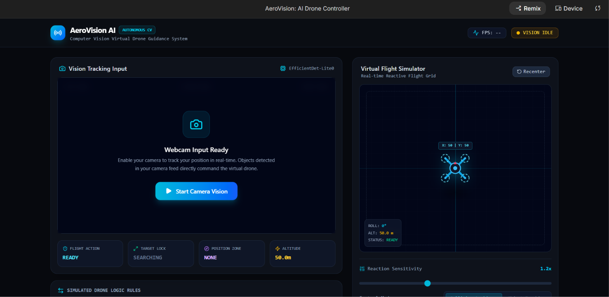

# AeroVision AI – Computer Vision Virtual Drone Guidance System

> **Real-time AI-powered virtual drone guidance using Computer Vision, Object Detection, and an Interactive Flight Simulator.**

AeroVision AI is a modern computer vision project that demonstrates how an autonomous drone can detect a person through a webcam, understand positional coordinates, and simulate intelligent flight decisions such as **Collision Avoidance** and **Object Tracking** in real time.

---

## Dashboard Preview

> Add this screenshot inside `assets/aerovision-dashboard.png`



---

## Why this project?

Autonomous drones are becoming essential for search & rescue, industrial inspection, smart surveillance, and disaster response.

Before deploying AI on a real drone, we need a safe environment where detection logic and flight decisions can be tested.

AeroVision AI acts as that virtual testing platform.

---

## Features

* Real-time webcam input
* AI-powered object detection
* Interactive virtual drone simulator
* Collision Avoidance mode
* Object Tracking mode
* Adjustable reaction sensitivity
* Live command stream
* Position-zone decision system
* Modern aerospace-inspired dark UI

---

## How It Works

1. User starts the webcam.
2. AI captures live video frames.
3. The detection model identifies the target.
4. The target's position is converted into coordinates.
5. The simulator generates a flight decision.
6. The virtual drone updates instantly.

### Detection Logic

| Target Position | Drone Response |
| --------------- | -------------- |
| Left            | Move Right     |
| Center          | Hover          |
| Right           | Move Left      |

---

## Project Workflow

```text
Webcam
   │
   ▼
AI Object Detection
   │
   ▼
Coordinate Mapping
   │
   ▼
Flight Decision Engine
   │
   ▼
Virtual Drone Simulator
```

---

## Dashboard Components

### Vision Tracking Input

* Live webcam feed
* AI detection
* Position analysis

### Virtual Flight Simulator

* Real-time drone visualization
* Coordinate updates
* Flight response simulation

### Flight Status

* Flight Action
* Target Lock
* Position Zone
* Altitude

### Control Modes

**Collision Avoidance**

* Moves away from detected obstacles
* Designed for safe navigation

**Object Tracking**

* Keeps the detected target centered
* Simulates autonomous following

### Reaction Sensitivity

Adjusts how quickly the drone responds to movement.

| Value | Behavior         |
| ----- | ---------------- |
| 1.0x  | Stable           |
| 1.2x  | Faster           |
| 1.5x+ | Highly sensitive |

### FPS Monitor

Displays how many camera frames are processed every second.

Higher FPS results in smoother tracking.

---

## Technology Stack

| Category        | Technology         |
| --------------- | ------------------ |
| Frontend        | Vite               |
| Language        | TypeScript         |
| Styling         | CSS                |
| Computer Vision | OpenCV             |
| AI Detection    | EfficientDet-Lite0 |
| Version Control | Git & GitHub       |

---

## Repository Structure

```text
AeroVision-AI/
│
├── assets/
│   └── aerovision-dashboard.png
├── src/
├── public/
├── README.md
├── package.json
├── vite.config.ts
└── tsconfig.json
```

---

## Installation

### Clone

```bash
git clone https://github.com/kusumakonchada/AeroVision-AI.git
```

### Open

```bash
cd AeroVision-AI
```

### Install

```bash
npm install
```

### Run

```bash
npm run dev
```

Open:

```
http://localhost:5173
```

---

## Real-World Applications

### Search & Rescue

Locate missing people in disaster areas.

### Industrial Inspection

Inspect towers, pipelines, and equipment without human risk.

### Smart Surveillance

Track moving targets using AI guidance.

### Forest Monitoring

Navigate through obstacles while monitoring wildlife and vegetation.

### Warehouse Automation

Assist indoor autonomous navigation.

---

## Current Capabilities

* Webcam-based detection
* Position-based virtual flight
* Collision simulation
* Interactive control modes
* Live visual feedback

---

## Future Improvements

* MediaPipe tracking
* Gesture-based drone control
* Multi-object tracking
* Real drone (DJI Tello) integration
* GPS simulation
* Flight path recording
* Obstacle distance estimation

---

## Author

**Kusuma Konchada**

B.Tech CSE Student • Computer Vision • AI • Full Stack Learning

GitHub: `kusumakonchada`

---

### If you found this project interesting, consider giving it a ⭐ on GitHub.
